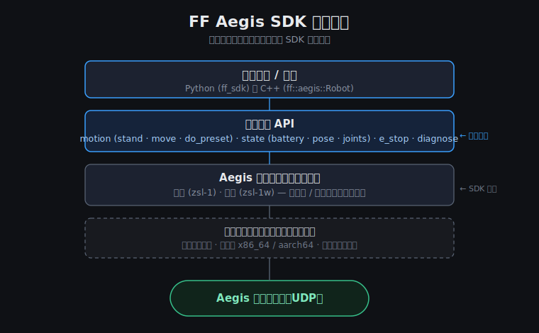

# FF SDK · Aegis 四足机器人开发包

欢迎使用 **Aegis 四足机器人**（产品代号 D1）开发包。本包面向开发者，包含上手文档和按主题分类的可运行示例 —— 用一套统一的 API 控制 Aegis 行走、做特技、读取遥测。



```python
import asyncio, ff_sdk

async def main():
    dog = await ff_sdk.connect("D1-DEMO")
    await dog.motion.stand()                     # 站立
    await dog.motion.cmd_vel(linear=0.3)         # 前进 0.3 m/s
    await asyncio.sleep(2)
    await dog.motion.stop()
    print(await dog.state.battery())             # 读电量
    await dog.motion.do_preset("shake_hand")     # 握手特技
    await dog.close()

asyncio.run(main())
```

---

## 1. 包内容

```
aegis_devkit/
├── README.md                  ← 你在看的这份
├── LICENSE                    ← 许可协议（Proprietary）
├── SECURITY.md                ← 安全问题上报方式
├── docs/
│   ├── QUICKSTART.md          ← 零基础 5 分钟上手（不需要真机）
│   ├── GLOSSARY.md            ← 名词表（Capability / dry-run / e_stop …）
│   ├── getting_started.md     ← 进阶入门（配置 / 诊断 / 紧急停止）
│   ├── camera_height_workflow.md ← ★ 机器人相机标定 + 身高估计流程
│   ├── d1_models.md           ← ★ Aegis 机型适配指南（EDU / Ultra / 点足 / 轮足）
│   └── deployment.md          ← ★ 部署指南（程序上机器人 / 开机自启 / 升级）
├── examples/                  ← Python 示例
│   ├── 01_hello_connect.py    ← 第一次连接 + 诊断 + 紧急停止
│   ├── 02_diagnose.py         ← 体检报告详解
│   ├── 03_estop.py            ← 紧急停止 + 回调 + 重置
│   ├── d1/
│   │   ├── udp_walk.py        ← Aegis 完整行走演示（站立 → 前进 → 转向 → 阻尼）
│   │   └── presets_and_telemetry.py  ← ★ 机型选择 + 特技 + 关节遥测
│   ├── motion/                ← 速度控制 / 预设动作 / 起立阻尼
│   ├── vision/
│   │   └── height_calculator.py ← ★ 相机网格标定 + YOLO/OpenCV 身高估计
│   ├── state/                 ← 电量 / 状态监听
│   └── cookbook/              ← 场景菜谱（安全看门狗 / 多机并发 / 轨迹记录 …）
├── wheels/                    ← ★ Python 安装包（aarch64 机器人 + x86_64 开发机）
└── cpp/                       ← ★ C++ SDK（头 + 预编译库 + 示例，见 cpp/README.md）
```

## 2. 安装 —— 一个 wheel，零依赖第三方厂商 SDK

SDK 以**自包含 wheel** 形式分发：机器人控制所需的底层运动库已经打包在 wheel 内部，
**不需要单独安装任何厂商 SDK、不需要在机器人上做任何额外配置**。

wheel 已随包提供在 `wheels/` 目录（Python 3.10）：

```bash
# 在机器人上（aarch64）
pip install wheels/ff_sdk-*-cp310-cp310-linux_aarch64.whl
# 在 Linux 开发机上（x86_64）
pip install wheels/ff_sdk-*-cp310-cp310-linux_x86_64.whl
```

| 你的环境 | 装哪个 wheel | 能做什么 |
|---|---|---|
| **Aegis 机器人本体**（推荐）| `aarch64` | 全部能力：运动 + 特技 + 全部遥测 |
| **Linux 开发机**（连机器人 WiFi 热点）| `x86_64` | 运动控制 + 状态遥测（远程模式，见 docs/d1_models.md §4）|
| **Windows / Mac 开发机** | 无需安装（纯学习）| dry-run 干跑模式：写代码、跑逻辑、不发真指令 |

> Windows / Mac 上无法装 wheel（底层运动库是 Linux 库），但可以先用 **dry-run 模式**
> 把代码全部写完调通（见下一节），再到 Linux / 机器人上实跑。
> 想用 C++ 而非 Python？见 [cpp/README.md](cpp/README.md)。

## 3. 没有真机？先用 dry-run 写代码

```bash
export FF_SDK_DRY_RUN=1        # Windows: set FF_SDK_DRY_RUN=1
python examples/01_hello_connect.py --target D1-DEMO
```

dry-run 模式下所有 API 照常调用、照常返回、照常打日志，只是不发真实指令。
**所有示例都支持 dry-run**，零风险学完整套 API 再碰真机。

## 4. 连接真机

1. 开机，等机器人热点出现（SSID 见机身标签 / 说明书）
2. 电脑 / 程序所在设备连上热点
3. 跑示例：

```bash
python examples/d1/udp_walk.py                # 默认连热点网关
FF_SDK_D1_HOST=<robot-ip> python examples/d1/udp_walk.py   # 指定 IP（以太网 / 局域网模式）
```

**机型选择**（点足 / 轮足 / EDU / Ultra）只需要一个环境变量，详见
[docs/d1_models.md](docs/d1_models.md)：

```bash
FF_SDK_D1_VARIANT=zsl-1  python examples/d1/udp_walk.py    # 点足（EDU / Ultra / XG01）
FF_SDK_D1_VARIANT=zsl-1w python examples/d1/udp_walk.py    # 轮足（默认）
```

## 5. Aegis 能做什么（速查）

| 能力 | API | 说明 |
|---|---|---|
| 速度控制 | `motion.cmd_vel(linear, angular, lateral)` | 前进 / 转向 / 横移 |
| 站立 / 趴下 / 阻尼 | `motion.stand()` / `do_preset("lie_down")` / `damping()` | |
| 特技 | `motion.do_preset("shake_hand" / "jump" / "front_jump" / "backflip" / "two_leg_stand")` | 注意安全空间 |
| 电量 | `state.battery()` | |
| 姿态状态 | `state.status()` | 站立 / 移动 / 趴下 / 阻尼 |
| 位姿 | `state.pose()` | 位置 + 姿态角 |
| 关节遥测 | `state.joint_states()` | 点足 12 关节 / 轮足 16 关节 |
| 紧急停止 | `session.e_stop(reason=...)` | 一等公民，500ms 内响应 |
| 健康诊断 | `session.diagnose()` | 连接 / 后端 / 遥测链路体检 |

## 6. 安全须知

- 第一次跑运动指令前，把机器人放在**空旷、平整**的地面，周围 1 米内无人无障碍物
- 特技动作（跳跃 / 后空翻 / 双腿站立）需要更大空间，且确保电量充足
- 写任何控制循环时，参考 `examples/cookbook/safety_watchdog.py` 加看门狗
- 紧急情况：调 `session.e_stop()`，或物理按下机器人背部急停按钮

## 7. 学习路线建议

1. [docs/QUICKSTART.md](docs/QUICKSTART.md) —— 5 分钟跑通第一个程序（dry-run）
2. `examples/01 → 02 → 03` —— 连接 / 诊断 / 紧急停止
3. [docs/d1_models.md](docs/d1_models.md) —— 确认你手上是哪个机型、选对 variant
4. `examples/d1/udp_walk.py` —— 真机第一次行走
5. `examples/d1/presets_and_telemetry.py` —— 特技 + 遥测
6. [docs/camera_height_workflow.md](docs/camera_height_workflow.md) —— 机器人相机标定 + 身高估计
7. `examples/cookbook/` —— 工程化模式（看门狗 / 多机 / 数据采集）
8. [docs/deployment.md](docs/deployment.md) —— 把程序正式部署到机器人上 + 开机自启

## 8. 常见问题

| 问题 | 解决 |
|---|---|
| `ModuleNotFoundError: ff_sdk` | wheel 没装上，或 Python 不是 3.10 |
| 连不上机器人 | 确认连的是机器人热点；`ping <robot-ip>` 通不通；跑 `02_diagnose.py` 看体检 |
| 指令发了不动 | 先 `motion.stand()` 站起来再 `cmd_vel`；看 `state.status()` 当前状态 |
| `joint_states` 报 `CapabilityNotSupported` | 轮足部分固件版本受限，见 docs/d1_models.md §5 |
| Windows 上想控真机 | 暂不支持（底层运动库为 Linux 库），用 Linux 开发机或直接在机器人上跑 |

更多排错见 [docs/getting_started.md](docs/getting_started.md) §9。
