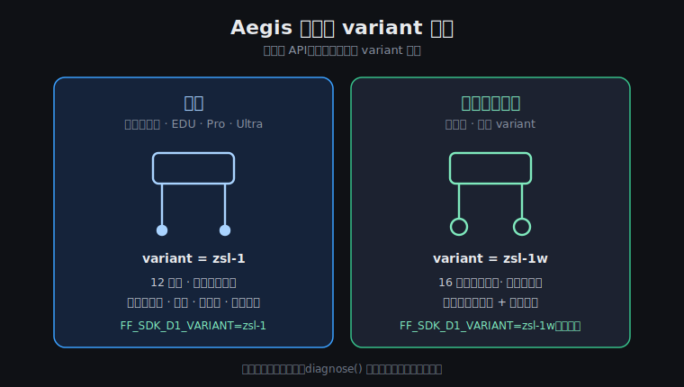

# Aegis 机型适配指南 — EDU / Ultra / 点足 / 轮足

Aegis（产品代号 D1）产品线有多个型号，但对开发者来说**API 完全一样**，只需要选对一个 `variant` 参数。
本文告诉你：手上这台是哪个机型、该填什么、各机型有什么差异。



---

## 1. 我手上是哪台？

| 看什么 | 点足（足端是橡胶脚垫）| 轮足 / 轮狗（足端是轮子）|
|---|---|---|
| 足端 | 4 个橡胶脚垫 | 4 个驱动轮 |
| 移动方式 | 迈步行走 | 轮式滑行 + 迈步混合 |
| 关节数 | 12（每腿 3 个）| 16（每腿 3 个 + 轮）|

| 产品型号 | 形态 | variant 参数 | 适配状态 |
|---|---|:---:|---|
| **标准版**（XG01 等点足批次）| 点足 | `zsl-1` | ✅ 真机验证（站立 / 行走 / 特技 / 全遥测）|
| **标准版**（XG03 等轮足批次）| 轮足 | `zsl-1w` | ✅ 真机验证（运动 + 状态遥测）；关节遥测见 §5 |
| **EDU 版**（教育版，D10 序列号）| 点足 | `zsl-1` | 🟡 已适配（与点足同一控制路径），待真机回归测试 |
| **Pro / Ultra**（D10 序列号）| 点足 | `zsl-1` | 🟡 已适配，待真机回归测试 |

> **EDU / Pro / Ultra 为什么直接适配？** 这几个型号是单板设计，运动控制器与点足标准版
> 同一套，SDK 走的底层协议 / 端口 / 默认 IP 完全一致。SDK 内置的运动库同时打包了
> 点足和轮足两套 binding，按 variant 自动加载。
>
> 🟡 表示"代码路径一致、应当直接可用"，但我们尚未在该型号真机上跑过完整回归。
> 你如果手上有 EDU / Ultra，跑一遍 `examples/d1/udp_walk.py` 就是最好的验证 ——
> 有问题请按 SECURITY.md / 支持渠道反馈。

---

## 2. variant 怎么填（三种方式，任选其一）

```bash
# 方式 1：环境变量（推荐，不改代码）
export FF_SDK_D1_VARIANT=zsl-1      # 点足 / EDU / Ultra
export FF_SDK_D1_VARIANT=zsl-1w     # 轮足（不设时的默认值）
```

```python
# 方式 2：Config 显式指定
from ff_sdk import Config
cfg = Config.from_env()
cfg.extra["d1_variant"] = "zsl-1"
dog = await ff_sdk.connect("D1-DEMO", config=cfg)
```

```python
# 方式 3：什么都不填 → 默认 zsl-1w（轮足）
dog = await ff_sdk.connect("D1-DEMO")
```

填错了会怎样？SDK 加载不到匹配的运动库时自动降级到通用通信路径，
`session.diagnose()` 会明确告诉你哪条链路没起来 —— 不会损坏机器人。

---

## 3. 网络连接（所有机型一致）

| 模式 | 怎么连 | host 填什么 |
|---|---|---|
| **热点直连**（默认）| 电脑连机器人自带 WiFi 热点 | 不用填（默认热点网关）|
| **以太网 / 局域网** | 机器人接入你的路由器 | `FF_SDK_D1_HOST=<robot-ip>` |

```bash
# 热点模式（默认）
python examples/d1/udp_walk.py

# 局域网模式
FF_SDK_D1_HOST=<robot-ip> python examples/d1/udp_walk.py
```

各型号热点名称 / 密码见机身标签或随机说明书。

---

## 4. 程序跑在哪？

| 部署方式 | 说明 | 推荐度 |
|---|---|---|
| **跑在机器人上** | 程序 scp 到机器人，本机回环控制，延迟最低 | ★★★ 推荐 |
| **跑在 Linux 开发机** | 开发机连机器人热点，远程控制 | ★★ 需要把机器人 SDK 服务的目标 IP 指向开发机（进阶配置，联系支持）|
| **跑在 Windows / Mac** | 仅 dry-run（底层运动库是 Linux 库）| ★ 学习 / 写代码用 |

---

## 5. 各机型能力差异

| 能力 | 点足（含 EDU / Ultra）| 轮足 |
|---|:---:|:---:|
| cmd_vel 速度控制 | ✅ | ✅ |
| stand / lie_down / damping | ✅ | ✅ |
| 特技（握手 / 跳跃 / 后空翻 / 双腿站立）| ✅ | ✅（部分特技动作集不同）|
| battery / status / pose | ✅ | ✅ |
| joint_states 关节遥测 | ✅ 12 关节 | ⚠️ 16 关节，**部分已出厂固件版本不可用**（SDK 会抛 `CapabilityNotSupported` 并说明原因），运动控制不受影响 |

```python
# 兼容写法：关节遥测做能力探测
from ff_sdk.core.exceptions import CapabilityNotSupported
try:
    joints = await dog.state.joint_states()
    print(f"{len(joints.names)} 个关节")
except CapabilityNotSupported as e:
    print(f"该机型/固件不支持关节遥测: {e}")
```

---

## 6. 特技动作清单

通过 `motion.do_preset(name)` 调用；`motion.known_presets()` 可在运行时列出当前机型支持的全部动作。

| name | 动作 | 预计耗时 | 注意 |
|---|---|---|---|
| `stand` / `stand_up` | 站立 | ~4s | |
| `lie_down` | 趴下 | ~3s | |
| `damping` / `passive` | 阻尼（软急停）| ~1s | 推荐收尾必调 |
| `shake_hand` | 握手 | ~10s | 全程别打断 |
| `jump` | 原地跳 | ~4s | 上方留空间 |
| `front_jump` | 前跳 | ~4s | 前方留 1m |
| `backflip` | 后空翻 | ~5s | ⚠️ 四周 2m 空旷 + 满电 |
| `two_leg_stand` | 双腿站立 | ~4s | 配合 `cancel_two_leg_stand` 恢复 |
| `recover` | 摔倒恢复 | ~3s | |

调用后用 `motion.preset_timeout(name)` 拿到建议等待时长再发下一条指令：

```python
res = await dog.motion.do_preset("shake_hand")
await asyncio.sleep(dog.motion.preset_timeout("shake_hand"))   # 等动作做完
```

---

## 7. 机型相关排错

| 现象 | 可能原因 | 解决 |
|---|---|---|
| diagnose 显示运动后端 `offline` | variant 填错（点足机器填了轮足）| 按 §1 表换 variant 重连 |
| 站立指令发了没反应 | 机器人还在阻尼/急停状态 | 先 `do_preset("stand")`，看 `state.status()` |
| 轮足 joint_states 报错 | 固件限制（§5）| 用 try/except 兼容写法 |
