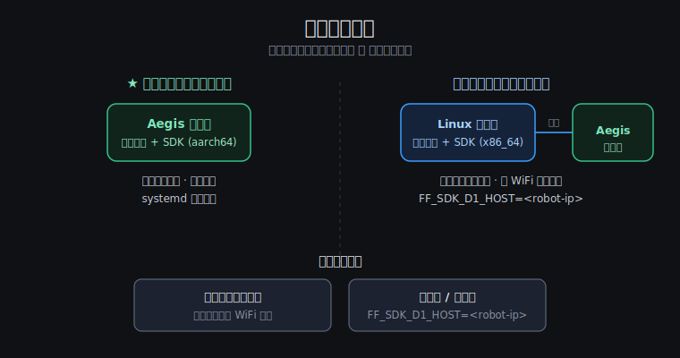

# Aegis 部署指南 — 把你的程序跑到机器人上

开发调通后（dry-run / 开发机直连），按本文把程序正式部署到 Aegis（产品代号 D1）上：
拷贝 → 安装 → 运行 → 开机自启。**全程不需要安装任何厂商 SDK**，
只需要 SDK wheel + 你自己的程序。



---

## 0. 前置条件

| 项 | 要求 |
|---|---|
| SDK wheel | `ff_sdk-<version>-cp310-cp310-manylinux2014_aarch64.whl`（FF 交付）|
| 机器人 SSH 账号 | 见随机说明书 / 机身标签（本文用 `<user>@<robot-ip>` 指代）|
| 网络 | 电脑连机器人热点，或机器人和电脑在同一局域网 |
| 机器人 Python | 3.10（Aegis 出厂自带，无需安装）|

确认 SSH 能通：

```bash
ssh <user>@<robot-ip> "python3 --version"
# 期望输出: Python 3.10.x
```

---

## 1. 部署 SDK（只需做一次）

```bash
# 1) 把 wheel 拷到机器人
scp ff_sdk-<version>-cp310-cp310-manylinux2014_aarch64.whl <user>@<robot-ip>:/tmp/

# 2) 安装（建议装进虚拟环境，不污染系统 Python）
ssh <user>@<robot-ip> "
  python3 -m venv ~/ff_app/venv &&
  ~/ff_app/venv/bin/pip install /tmp/ff_sdk-*.whl
"

# 3) 验证
ssh <user>@<robot-ip> "~/ff_app/venv/bin/python -c 'import ff_sdk; print(ff_sdk.__version__)'"
```

> **机型说明**：wheel 内同时包含点足（`zsl-1`）和轮足（`zsl-1w`）两套运动库，
> EDU / Ultra / 标准版同一个 wheel 通用，按 [d1_models.md](d1_models.md) 设 variant 即可。

---

## 2. 部署你的程序

```bash
# 把你的程序目录拷上去（以 my_dog_app/ 为例）
scp -r my_dog_app/ <user>@<robot-ip>:~/ff_app/

# 在机器人上跑（程序跑在机器人本机 → host 用回环，无需设 FF_SDK_D1_HOST）
ssh <user>@<robot-ip> "
  cd ~/ff_app/my_dog_app &&
  FF_SDK_D1_VARIANT=zsl-1 ~/ff_app/venv/bin/python main.py
"
```

variant 取值速查（详见 [d1_models.md](d1_models.md) §1）：

| 机型 | `FF_SDK_D1_VARIANT` |
|---|---|
| 点足标准版 / EDU / Pro / Ultra | `zsl-1` |
| 轮足（轮狗）| `zsl-1w`（默认，可不设）|

---

## 3. 开机自启（systemd 用户服务）

让你的程序随机器人开机自动运行：

```bash
ssh <user>@<robot-ip>
```

在机器人上创建服务文件 `~/.config/systemd/user/my-dog-app.service`：

```ini
[Unit]
Description=My Aegis application (ff_sdk)
After=network-online.target

[Service]
Type=simple
WorkingDirectory=%h/ff_app/my_dog_app
Environment="FF_SDK_D1_VARIANT=zsl-1"
ExecStart=%h/ff_app/venv/bin/python main.py
Restart=on-failure
RestartSec=5

[Install]
WantedBy=default.target
```

启用：

```bash
systemctl --user daemon-reload
systemctl --user enable --now my-dog-app
loginctl enable-linger $USER        # 关键: 不登录也启动用户服务

# 看状态 / 日志
systemctl --user status my-dog-app
journalctl --user -u my-dog-app -f
```

> ⚠️ **安全提醒**：开机自启的程序不要在启动时直接发运动指令。
> 建议程序启动后等待外部触发（按钮 / 网络指令 / 语音）再动，
> 并参考 `examples/cookbook/safety_watchdog.py` 加看门狗。

---

## 4. 升级 SDK 版本

```bash
scp ff_sdk-<new-version>-*.whl <user>@<robot-ip>:/tmp/
ssh <user>@<robot-ip> "
  systemctl --user stop my-dog-app &&
  ~/ff_app/venv/bin/pip install --force-reinstall /tmp/ff_sdk-<new-version>-*.whl &&
  systemctl --user start my-dog-app
"
```

---

## 5. 另一种部署形态：Linux 开发机远程控制

程序不放机器人上，跑在你的 Linux 开发机上（适合调试期 / 算力重的应用）：

```bash
# 开发机装 x86_64 wheel
pip install ff_sdk-<version>-cp310-cp310-manylinux2014_x86_64.whl

# 开发机连机器人热点后运行
FF_SDK_D1_HOST=<robot-ip> python main.py
```

| 对比 | 跑在机器人上 | 跑在开发机上 |
|---|---|---|
| 延迟 | 最低（本机回环）| 受 WiFi 质量影响 |
| 算力 | 受限于机器人板载 CPU | 开发机算力随便用 |
| 断网表现 | 不受影响 | WiFi 断 = 失控（SDK 心跳失联会让机器人停下，但仍要小心）|
| 适合 | 正式部署 / 演示 | 开发调试 / AI 大模型类应用 |

> 远程模式下部分需要本机回环的高级遥测可能受限；`session.diagnose()`
> 会如实报告每条链路状态。

---

## 6. 部署排错

| 现象 | 解决 |
|---|---|
| `pip install` 报 ABI / platform 不匹配 | wheel 架构拿错了：机器人上必须用 `aarch64`，开发机用 `x86_64`；Python 必须 3.10 |
| 服务起来了但机器人不动 | `journalctl --user -u my-dog-app -f` 看日志；先确认手动跑 `examples/d1/udp_walk.py` 能动 |
| 开机后服务没起 | 忘了 `loginctl enable-linger`；或 `WantedBy` 写错（用户服务是 `default.target`）|
| 程序在开发机能跑、上机器人就报错 | 检查 variant 环境变量是否写进了 service 文件的 `Environment=` |
